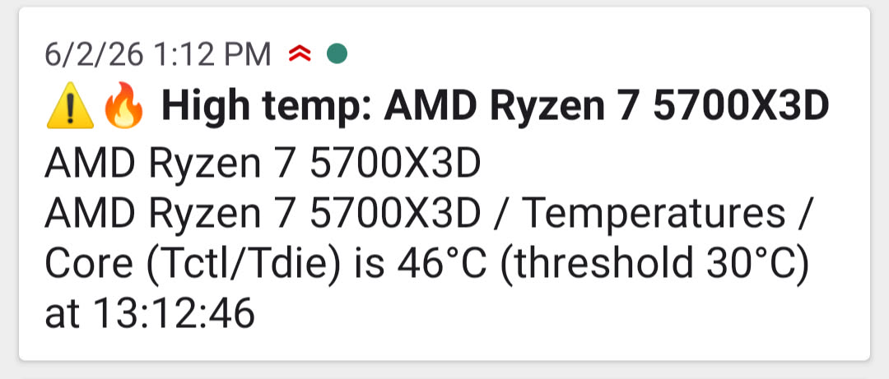
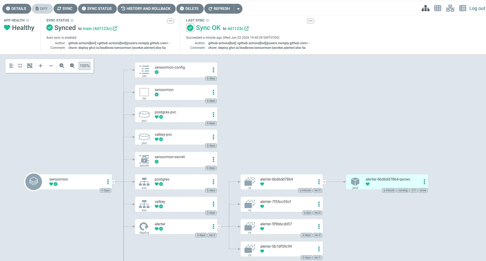

<pre>

███████╗███████╗███╗   ██╗███████╗ ██████╗ ██████╗ ███╗   ███╗ ██████╗ ███╗   ██╗
██╔════╝██╔════╝████╗  ██║██╔════╝██╔═══██╗██╔══██╗████╗ ████║██╔═══██╗████╗  ██║
███████╗█████╗  ██╔██╗ ██║███████╗██║   ██║██████╔╝██╔████╔██║██║   ██║██╔██╗ ██║
╚════██║██╔══╝  ██║╚██╗██║╚════██║██║   ██║██╔══██╗██║╚██╔╝██║██║   ██║██║╚██╗██║
███████║███████╗██║ ╚████║███████║╚██████╔╝██║  ██║██║ ╚═╝ ██║╚██████╔╝██║ ╚████║
╚══════╝╚══════╝╚═╝  ╚═══╝╚══════╝ ╚═════╝ ╚═╝  ╚═╝╚═╝     ╚═╝ ╚═════╝ ╚═╝  ╚═══╝
containerized hardware monitoring on my home server
</pre>

The core of the project is two .NET 10 BackgroundServices running in [k3s](https://k3s.io/) on my home server, a worker and an alerter. The worker periodically polls the endpoint created by [LibreHardwareMonitor](https://github.com/LibreHardwareMonitor/LibreHardwareMonitor) on my desktop, and writes the data to a Postgres db, also containerized. If a temperature sensor exceeds a threshold defined in the config, the worker will emit an event to a Valkey stream, which the alerter will consume and send a push notification to my phone with details via [ntfy.sh](https://ntfy.sh). (The two services share a schema defining what exactly an alert should look like). A CronJob periodically prunes old readings from the database.

In addition, on pushing to main, a github workflow builds a new image, pushes it to GHCR and updates the proper image tag in kustomization.yaml. [Argo CD](https://argoproj.github.io/cd/) detects the updated manifest in git and reconciles the cluster to match, causing k3s to pull the new image.

---

    

    An example notification on my phone. The threshold temperature was set to 30° C for testing purposes.

    

    A partial screenshot of the deployment, as seen in Argo CD.

## TODO
- Add test stage to ci/cd pipeline
- General cleanup
